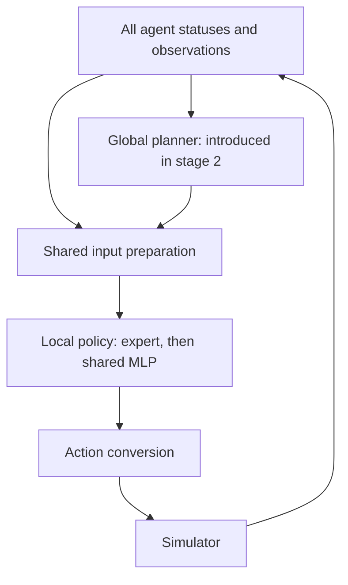

# Survival simulator development plan

Build the controller in four stages: a local expert system, a global planner, an MLP trained to imitate the expert, and finally reinforcement learning with PPO. Each stage must leave us with a runnable controller and measured results before we add the next layer.

This document describes proposed work. The controllers, training pipeline, and benchmarks below have not been implemented or evaluated yet.

## Objective and working assumptions

Maximize the simulator's actual score by keeping the species alive, collecting fruit, and limiting losses to predators. Population size and inherited traits are resources for achieving that objective; neither receives a direct score bonus.

The current score is:

```text
simulated time
+ total energy of fruit eaten / 1,000
- total remaining energy of agents eaten by predators / 100
```

The local runner ends a game when the species becomes extinct or simulated time exceeds 3,000 seconds. Preserve the runner's exact termination behavior in evaluation. The default timestep is 0.1 simulated seconds.

Useful mechanics to account for:

| Mechanic | Current implementation |
| --- | --- |
| Initial / newborn energy | Initial agents receive 150; offspring start with 75 before that tick's environmental update. |
| Reproduction | Requires more than 100 energy after movement and turning; costs 100 and happens immediately. No built-in cooldown. |
| Fruit | Starts at 20 energy and grows by 2 per simulated second to approximately 60. The observation does not expose its energy. |
| Movement | Walking costs 0.05 per distance unit. Distance beyond walking speed costs 0.5 per unit. Below 20% of maximum energy, sprinting is restricted. |
| Turning | Costs `min(pi, abs(turn_angle)) / (2 * pi)`. Turning and movement are separate controls. |
| Aging | Age advances with simulated time. After a hidden threshold drawn from 60–120 seconds, the agent loses an additional `0.01 * age` energy per tick. |
| Predators | Start at zero by default and spawn over time. Exhausted predators rest and recharge instead of dying. |
| Inheritance | Offspring inherit movement, energy-capacity, and sensing traits, with a 10% mutation chance per trait and multipliers from 0.5 to 1.5, subject to caps. |

These facts come from [environment.py](src/elements/environment.py), [agent.py](src/elements/agent.py), [fruit.py](src/elements/fruit.py), [core.py](src/core.py), and [simulation_server.py](simulation_server.py). Treat the implementation as authoritative when README descriptions differ.

## Architecture that carries through all four stages



The planner remains the same code during expert demonstrations, supervised training, PPO training, and deployment. It recomputes decisions from the current game; we do not replay old assignments. Initially its strategy is fixed while we train the MLP.

All agents eventually use one shared MLP with the same weights. Their observations, capabilities, and instructions differ. Newborns use the existing network immediately.

Keep the expert and MLP interchangeable behind a local-policy interface. Shared preprocessing and action conversion must behave identically in evaluation and training. Stage 1 uses neutral planner instructions.

## Stage 1: build a local expert system

**Deliverable:** a deterministic, inspectable policy that can find food, avoid immediate danger, and reproduce without a global planner or learning dependencies.

### Inputs

Start with a compact prepared observation. The following object counts are initial design choices to test, not simulator limits.

| Group | Initial contents |
| --- | --- |
| Own state | Energy, maximum energy, age, biome. |
| Capabilities | Walking speed, sprint speed, hearing radius, vision range, vision angle. |
| Food | Relative vectors to the nearest 3 observed fruits and 2 observed trees. |
| Threats | Relative vectors and observed orientation information for the nearest 2 predators. |
| Neighbors | Relative vectors to the nearest 3 agents, plus observed neighbor count. |
| Obstacles | Fixed-size features derived from observed edge segments, including validity information. |
| History, if needed | Previous action and a remembered local target, with age/confidence of the estimate. |

Convert observed distance and angle to local Cartesian vectors. Sort object slots consistently, normalize numeric inputs, and give each slot a presence flag. Unobserved directions must remain distinguishable from known clear directions. Decode predator orientation according to `creature.py`; its `rel_dir` field is not a world heading.

Raw fields are defined in [DTOs.py](src/utils/DTOs.py) and [creature.py](src/elements/creature.py). The API does not expose absolute position or heading, exact fruit energy, predator energy/resting status, or an agent's exact aging threshold. Any estimates must be derived from observations and history. Use agent IDs for bookkeeping, rather than as arbitrary numeric policy features.

If the expert uses memory or additional object information, expose equivalent features to the MLP before collecting demonstrations. Otherwise the student cannot reliably reproduce the teacher's decisions.

### Decision logic

1. Detect immediate danger and choose an escape direction with usable clearance. Consider all predator slots so escaping one does not lead directly toward another. Sprint when the situation justifies the extra energy cost.
2. Otherwise score visible food targets using travel distance, estimated movement cost, predator proximity, and route obstruction. Favor a useful reachable target over simply choosing the nearest fruit.
3. With no suitable fruit, explore toward observed trees or open space. Use consistent tie-breaking or remembered direction to avoid oscillation.
4. Choose facing direction deliberately: movement can go one way while the agent looks another way. Avoid paying for unnecessary turning every tick.
5. Decide reproduction separately. Require an energy reserve after movement, turning, and the 100-energy spawn cost; account for local danger, food, crowding, and age. Put thresholds in configuration so they can be tuned.

Movement targets are relative to the agent's facing direction. Convert a requested displacement `(dx, dy)` to `move_distance = hypot(dx, dy)` and `move_direction = atan2(dy, dx)`, using zero direction for zero displacement. The code uses a relative movement angle, despite the README's absolute-angle description. Movement happens before turning, then reproduction; account for that order when calculating reserves.

### Implementation and checks

- Add an expert policy and a shared feature/action adapter; connect the expert through the existing `/predict` endpoint.
- Keep policy memory per episode and agent ID. Clear it between games and remove dead-agent entries; births must not inherit stale controller state accidentally.
- Create an evaluation runner around `SimulationCore` that avoids HTTP, live drawing, and per-tick console output. Preserve simulation mechanics and RNG behavior. In particular, skipping initialization code that consumes randomness can change seeded worlds.
- Use separate policy randomness so exploration never consumes the simulator's RNG stream.
- Log score, survival time, fruit events, births, predator losses, population, and action latency. Internal state may be used for evaluation diagnostics without becoming a policy input.
- Check meaningful cases: relative movement and turn order, zero movement, missing observations, low-energy behavior, post-movement reproduction eligibility, and memory reset across games.

**Advance when:** actions are valid, behavior is understandable in replays, and the expert improves on the dummy policy across the development seeds. Record full-game results even if the species cannot yet survive the entire horizon. Save this baseline for all later comparisons.

## Stage 2: add the global planner

**Deliverable:** the same expert policy, now conditioned on instructions derived from the state of the species.

Start with coordination that works without a global map. The planner can inspect every living agent's observed traits, energy, age, biome, and local resource/threat reports, plus population and simulation time.

| Instruction | Meaning |
| --- | --- |
| Reproduction priority | Relative preference for this agent to produce offspring. |
| Desired energy reserve | Energy the agent should aim to retain after reproduction. |
| Separation preference | How strongly to avoid crowding observed neighbors. |
| Exploration preference | How strongly to search for new food rather than stay near a current patch. |
| Optional target and radius | A desired region, expressed relative to the agent, once localization is available. Include validity/confidence. |

Favor reproduction by agents with useful inherited traits and a viable local situation. Evaluate trait usefulness empirically: a simple sum of raw statistics is not a reliable fitness measure. Population recovery may justify reproducing ordinary agents when few remain. The local policy should still be able to postpone reproduction during immediate danger or insufficient energy.

Spread agents in relation to food and danger rather than enforcing uniform geometric spacing. Keep assignments stable enough to avoid constant switching, and let agents leave an assigned area when survival requires it. Recompute strategic instructions less frequently than movement if benchmarks show that works, with event-driven updates after important births, deaths, or threats.

### Optional second part: persistent spatial assignments

True shared regions require a separate localization/mapping component. The API provides relative observations; collecting everyone's observations does not automatically produce a shared coordinate system.

Investigate alignment through sightings of identified agents and persistent geometry. Track uncertainty. Movement commands alone are insufficient for exact tracking because terrain, obstacles, and boundaries can alter actual displacement. Fruit observations do not include stable IDs, so avoid assuming easy cross-agent fruit matching.

Only enable map-based targets after reconstruction is reliable enough on evaluation scenarios. Fall back to local separation and exploration when confidence is low. The simpler planner is sufficient to proceed to stage 3.

**Advance when:** planned expert policies outperform or demonstrably improve survival reliability over the local expert on the same development seeds. Measure crowding and population stability as diagnostics, while retaining actual score as the objective. Save both versions and freeze a planner/input version for demonstration collection.

## Stage 3: train an MLP to imitate the expert

**Deliverable:** one shared MLP that replaces the local expert while retaining the planner and action interface.

Behavior cloning trains a policy on observation–action examples from a teacher. Here the teacher is our expert plus its planner-conditioned inputs. See the [behavior cloning documentation](https://imitation.readthedocs.io/en/stable/algorithms/bc.html).

### Demonstrations and network

Record the exact inputs available before each decision, the expert action, episode/seed, agent ID, and schema/planner versions. Include varied planner instructions, inherited traits, ages, energy levels, and danger. Keep both reproduction outcomes represented without making the learned birth rate artificially high through careless resampling.

Split datasets by complete simulation seeds, not random adjacent ticks. Fit input normalization only on training data. Keep a reproducible record of what data and configuration produced each checkpoint.

Start with two hidden layers of 64 neurons. This is an initial size to benchmark, not a proven optimum. Output movement components, turning, and a reproduction logit. Use a consistent bounded action representation compatible with the later stochastic PPO policy. Treat angular wraparound explicitly in the turning representation or loss.

Train movement and turning with suitable regression losses and reproduction with binary classification loss; balance them so one output does not dominate. Equivalently, a compatible stochastic policy can maximize expert-action likelihood. Any action limits or transformations must remain consistent across teacher labels, MLP inference, and PPO.

### Validate behavior, then repair gaps

Run complete simulations under MLP control, not just prediction-error checks. Compare the expert and MLP on identical held-out development seeds, including survival, score, reproduction behavior, and latency.

If the MLP drifts into unfamiliar situations, let it visit those situations and ask the expert for labels there. Add those labeled inputs and retrain. This is the motivation for [DAgger](https://proceedings.mlr.press/v15/ross11a.html). The expert must label the state actually reached, without using future outcomes.

**Advance when:** the MLP is close enough to the planned expert on full-game performance to serve as a useful starting policy, without systematic starvation, reproduction, or navigation failures. Set the acceptable gap before selecting the checkpoint. Preserve the expert and cloned model as independent baselines.

## Stage 4: improve the MLP with PPO

**Deliverable:** a reward-trained shared policy initialized from the cloned MLP, evaluated against all earlier baselines.

PPO updates an action policy using newly collected experience and estimates of future reward. A critic supplies the value estimates and is a training component. The deployed controller retains the planner and action policy. See [PPO documentation](https://spinningup.openai.com/en/latest/algorithms/ppo.html). Cooperative PPO is a useful starting reference, rather than evidence that it will outperform this project's expert: [multi-agent PPO research](https://proceedings.neurips.cc/paper_files/paper/2022/hash/9c1535a02f0ce079433344e14d910597-Abstract.html).

### Training setup

- Initialize the actor from the cloned checkpoint. Train the critic explicitly; copying expert actions does not establish an accurate value function.
- Keep the planner fixed initially. Use observations and planner outputs that can also be produced during deployment.
- Use a distribution over continuous movement/turning and a Bernoulli distribution for reproduction. Implement correct likelihoods for the chosen action transformations. A mixed action space and variable population need explicit support; a stock single-agent PPO call is not the complete integration.
- Collect fresh rollouts under the current policy, then perform PPO updates. Demonstration data can support a separate temporary imitation objective, but is not fresh on-policy PPO experience.
- Use diverse training seeds. `SimulationCore.reset()` reuses its original seed; the wrapper must deliberately create or select new seeded episodes.
- Batch living agents through the shared actor. Keep IDs and active-agent masks in rollout bookkeeping. Newborns begin new action records; dead agents generate no subsequent policy actions.

### Team credit and rewards

Use `score_after - score_before` as the base team reward for each world step. Do not multiply this reward by the number of living agents or turn it into a population bonus. Record one world timeline and define actor-loss aggregation explicitly so population changes do not silently redefine the objective.

Prefer a team critic that consumes a fixed-size summary or pooled representation of the current population and planner context. Calculate team returns on the world timeline. A parent's earlier actions must be able to receive credit for descendants that help the species after that parent dies; do not truncate those team returns at individual death.

Mark individual inactivity separately from the end of a species episode. Match the 3,000-second scoring horizon. A rollout chunk ending before the game ends should bootstrap value estimates; an actual end of the evaluated game should not bootstrap beyond its horizon.

Start with the true score reward. If exploration is inadequate, test small, documented shaping terms for food or safe goal progress. They change training incentives and must earn their place in comparisons. Avoid an unconditional birth reward or a reward for raw stored energy, which could favor excessive reproduction or discourage useful reproduction respectively.

Select discount and rollout settings with simulated time in mind. At 10 ticks per second, a seemingly conventional per-step discount can heavily suppress consequences tens of seconds later, including reproduction benefits. Preserve exploration after cloning and monitor whether updates destroy useful baseline behavior.

**Advance when:** PPO demonstrates a repeatable improvement in actual full-game score or survival reliability against the cloned policy on validation seeds, then confirms the result on a reserved final seed set. If it fails this comparison, retain the strongest earlier controller.

## Evaluation protocol used throughout

1. Establish fixed training, development, and final-test seed sets. Use development seeds to tune rules and select checkpoints; keep final-test seeds out of tuning and demonstrations.
2. As a starting budget, use 10 development seeds for quick iteration and 30 reserved seeds for final comparisons. Increase coverage if results vary widely. These are planning defaults, not guarantees of statistical confidence.
3. Compare policies on the same seeds and preserve per-seed results. Report mean and median score, variation, survival time, and fraction of games reaching the horizon. Show poor runs as well as averages.
4. Track diagnostics separately: food collection, starvation/predation losses, births, peak population, trait distribution, crowding, and inference latency. Local simulation internals may provide diagnostics without entering controller observations.
5. Save the seed, code revision, policy/planner configuration, model checkpoint, schema/normalization version, and action RNG seed with each run. Repeat promising learned configurations with more than one training seed.
6. Exercise the real `/predict` integration after local evaluation, including initial empty status, births/deaths, episode restart, and sequential games. All state must reset between games.

The competition evaluation is described as averaging three runs and permitting one final attempt in the [README](README.md). Treat that attempt as the final submission, not a development benchmark.

## Suggested implementation layout

These are proposed additions; create them as their stage needs them.

| Proposed component | Responsibility | First needed |
| --- | --- | --- |
| `src/utils/controllers/expert_policy.py` | Local expert decisions and configurable thresholds | Stage 1 |
| `src/utils/controllers/policy_inputs.py` | Shared prepared features, normalization schema, optional history | Stage 1 |
| `src/utils/controllers/action_adapter.py` | Convert policy outputs to simulator actions | Stage 1 |
| `evaluate_policy.py` | Seeded evaluation, summaries, replay diagnostics | Stage 1 |
| `src/utils/controllers/global_planner.py` | Species-level priorities and per-agent instructions | Stage 2 |
| `src/utils/controllers/world_estimator.py` | Optional shared localization and confidence | Stage 2, only for spatial regions |
| `training/collect_demonstrations.py` | Versioned expert trajectories | Stage 3 |
| `training/train_bc.py` | Supervised pretraining and validation | Stage 3 |
| `src/utils/controllers/mlp_policy.py` | Shared learned policy and checkpoint loading | Stage 3 |
| `training/simulator_env.py` | Training wrapper, reward timeline, population bookkeeping | Stage 4 |
| `training/train_ppo.py` | Actor/critic optimization and checkpoint evaluation | Stage 4 |

Store large trajectories and model checkpoints outside source control or in an intentionally chosen artifact store. Add learning dependencies when implementing stages 3–4, and verify their support for our action and population model then. Keep the stage-1 expert runnable independently.

## First implementation milestone

Implement only the shared local inputs/action adapter, expert policy, endpoint integration, and seeded evaluator. Start with food selection, obstacle-aware movement, predator escape, and energy-aware reproduction. Record the expert-versus-dummy results before adding species-level planning.
