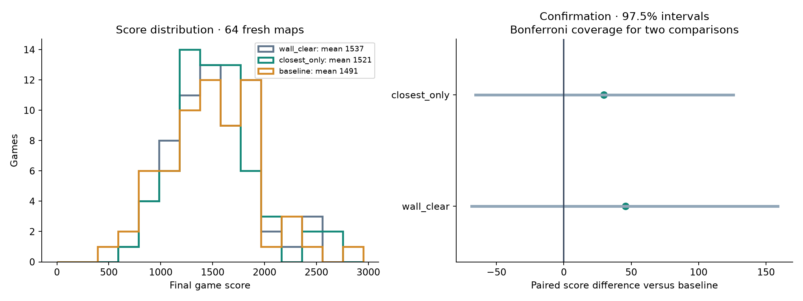
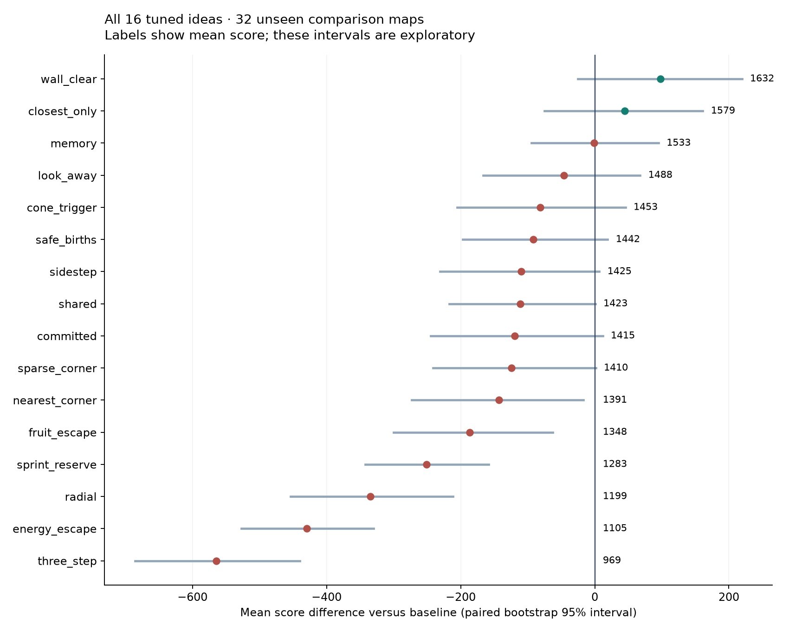

# Avoidance experiment results

Completed **2,784 native full games** in **22.2 minutes** on 32 Runpod vCPUs.

The unchanged baseline and each candidate ran on identical seeds within each evaluation split. Training maps were never used for the following comparisons.

## Final confirmation

| Approach | Mean score | Difference | Paired 97.5% interval | Wins / 64 |
|---|---:|---:|---:|---:|
| wall_clear | 1536.6 | +45.8 | [-68.6, +158.7] | 36 |
| closest_only | 1520.6 | +29.8 | [-65.5, +125.9] | 35 |
| baseline | 1490.8 | +0.0 | [+0.0, +0.0] | 0 |

The two finalists were selected using the separate comparison maps. Their intervals use 97.5% paired bootstrap coverage each (Bonferroni adjustment for two comparisons). Intervals crossing zero do not establish an improvement.

## All sixteen approaches

These are selection-stage results on 32 maps, not the final confirmation.

| Approach | Idea | Mean score | Difference |
|---|---|---:|---:|
| wall_clear | Deflect escapes around observed walls | 1631.8 | +97.6 |
| closest_only | Forage when another visible agent is closer | 1578.7 | +44.6 |
| baseline | Unchanged Oscar Orchard avoidance | 1534.2 | +0.0 |
| memory | Avoid orchard posts near remembered predators | 1533.4 | -0.7 |
| look_away | Escape without turning gaze toward predator | 1487.8 | -46.4 |
| cone_trigger | Tune facing-angle threshold for reacting | 1453.0 | -81.1 |
| safe_births | Delay reproduction near a seen predator | 1442.2 | -91.9 |
| sidestep | Tuned sideways escape | 1424.7 | -109.5 |
| shared | React to current group sightings | 1423.3 | -110.9 |
| committed | Keep an escape heading for several ticks | 1414.5 | -119.7 |
| sparse_corner | Steer toward one observed sparse corner, target ±10 degrees | 1410.1 | -124.0 |
| nearest_corner | Steer toward nearest corner, target ±10 degrees | 1391.5 | -142.7 |
| fruit_escape | Choose one-step cone exits favoring the orchard direction | 1347.9 | -186.3 |
| sprint_reserve | Preserve energy needed for future sprinting | 1283.5 | -250.7 |
| radial | Walk or sprint directly away | 1199.3 | -334.8 |
| energy_escape | Choose one-step cone exits with an energy price | 1104.8 | -429.4 |
| three_step | Choose movement using three-step pursuit approximation | 969.4 | -564.7 |

## Limits

- Each family received only 16 trials on eight training maps: one baseline-like initial setting, five random starts, and ten Gaussian-process expected-improvement proposals. More tuning could change the ranking.
- Each approach also tunes reaction and sprint distances. Results compare tuned policy packages; they do not isolate the causal benefit of the named mechanism.
- Raw scores measure complete ordinary games. Approximate pursuit search does not use hidden predator state, and is not an exact physics rollout.
- Corner settings target ±10°, but these score tests do not independently verify that angular behavior.
- Comparison-stage intervals are exploratory and unadjusted across the 16 approaches. Confirmation is kept separate to reduce selection bias.
- Runtime is elapsed experiment time, excluding pod startup, build, transfer and teardown; billed cost is recorded separately.

## Compute cost

The worker was deleted after download and its absence verified. Conservative
compute/disk estimate: **$0.43**. Billing has not posted yet. Total research
estimate remains below the authorized $10 cap. See [cost.json](cost.json).

## Reproduction

Exact configurations: [tuned-configs.json](tuned-configs.json). Source and environment hashes: [manifest.json](manifest.json). Trial history: [trials.json](trials.json). Every game: [games.jsonl.gz](games.jsonl.gz).
