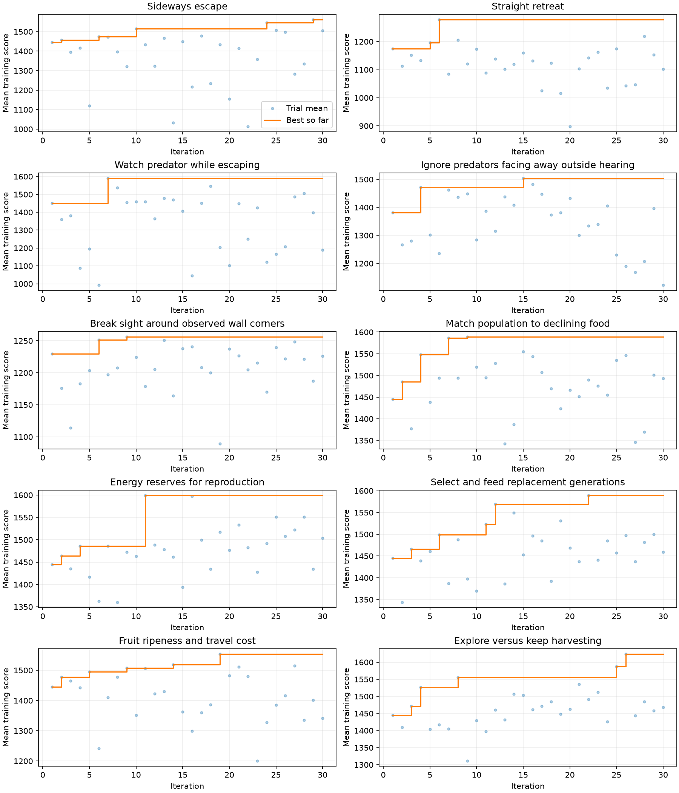
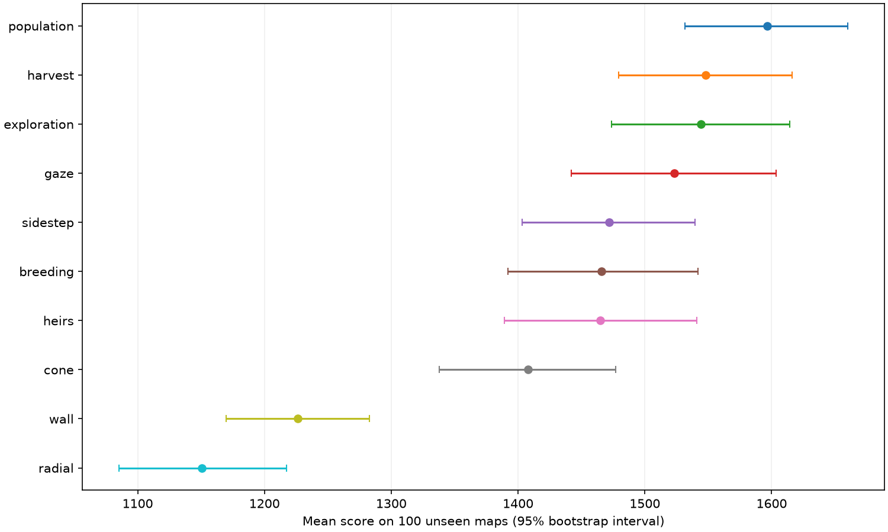

# Ten-family Bayesian experiment

30 trials per family on the same 32 training maps; best training configuration evaluated on the same 100 unseen maps. Objective: mean full-game score. Normal energy and predators, 3000-second horizon. C++ engine and policy. Policy random seed fixed at 0 independently of world seed.

| Family | Initial training | Best training | Best iteration | Test mean | 95% CI |
|---|---:|---:|---:|---:|---|
| population | 1445.0 | 1589.2 | 9 | 1596.4 | 1531.6–1660.1 |
| harvest | 1445.0 | 1553.8 | 19 | 1548.0 | 1479.1–1616.3 |
| exploration | 1445.0 | 1624.0 | 26 | 1544.2 | 1473.8–1614.4 |
| gaze | 1449.9 | 1590.5 | 7 | 1523.3 | 1441.8–1603.5 |
| sidestep | 1445.0 | 1561.9 | 29 | 1471.9 | 1403.2–1539.4 |
| breeding | 1445.0 | 1599.2 | 11 | 1465.8 | 1392.0–1541.7 |
| heirs | 1445.0 | 1589.4 | 22 | 1465.0 | 1389.4–1540.8 |
| cone | 1381.9 | 1504.2 | 15 | 1407.9 | 1338.1–1477.0 |
| wall | 1229.5 | 1256.2 | 9 | 1226.4 | 1169.6–1282.8 |
| radial | 1174.0 | 1278.3 | 6 | 1150.9 | 1085.3–1217.5 |

Untuned control mean: 1536.7.

Test ranking is descriptive: selecting the top of ten introduces selection bias. These intervals estimate individual means and do not establish superiority between families. Training best-so-far is optimistic because it selects among 30 trials.

