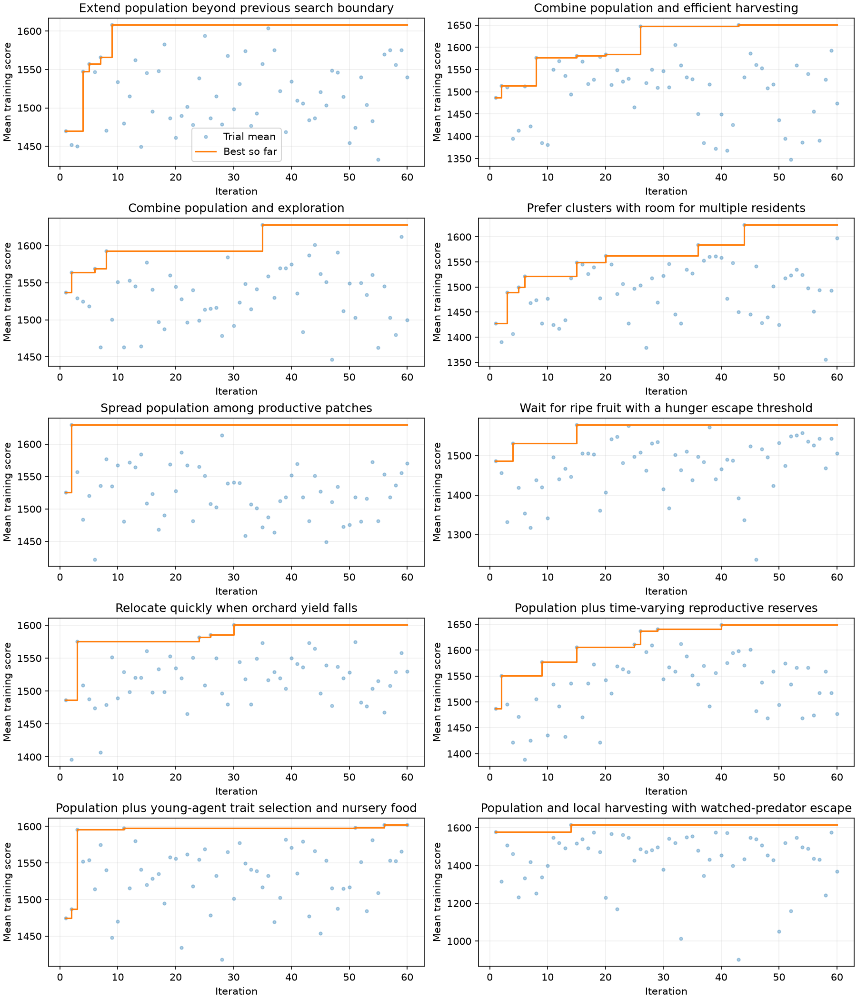
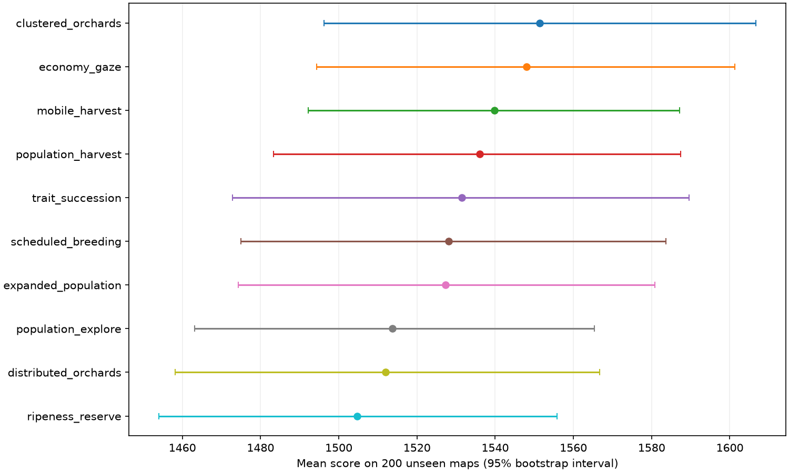

# Ten-family Bayesian experiment

60 trials per family on the same 64 training maps; best training configuration evaluated on the same 200 unseen maps. Objective: mean full-game score. Normal energy and predators, 3000-second horizon. C++ engine and policy. Policy random seed fixed at 0 independently of world seed.

| Family | Initial training | Best training | Best iteration | Test mean | 95% CI |
|---|---:|---:|---:|---:|---|
| clustered_orchards | 1427.8 | 1624.2 | 44 | 1551.4 | 1496.2–1606.7 |
| economy_gaze | 1577.5 | 1616.1 | 14 | 1548.1 | 1494.4–1601.3 |
| mobile_harvest | 1486.5 | 1600.8 | 30 | 1539.8 | 1492.2–1587.2 |
| population_harvest | 1486.5 | 1650.8 | 43 | 1536.1 | 1483.4–1587.5 |
| trait_succession | 1474.9 | 1602.3 | 56 | 1531.5 | 1472.8–1589.6 |
| scheduled_breeding | 1487.1 | 1649.1 | 40 | 1528.0 | 1475.0–1583.7 |
| expanded_population | 1469.9 | 1608.2 | 9 | 1527.3 | 1474.4–1580.8 |
| population_explore | 1537.1 | 1628.3 | 35 | 1513.7 | 1463.1–1565.4 |
| distributed_orchards | 1525.5 | 1629.9 | 2 | 1511.9 | 1458.1–1566.7 |
| ripeness_reserve | 1486.5 | 1578.2 | 15 | 1504.7 | 1454.0–1555.8 |

Previous population winner mean: 1506.3.

Original baseline mean: 1509.9.

| Family | Paired difference vs previous winner | 95% paired CI |
|---|---:|---|
| clustered_orchards | +45.1 | -11.3–+101.8 |
| economy_gaze | +41.7 | -16.6–+100.9 |
| mobile_harvest | +33.5 | -29.6–+95.4 |
| population_harvest | +29.7 | -26.7–+85.3 |
| trait_succession | +25.2 | -34.5–+85.2 |
| scheduled_breeding | +21.7 | -37.0–+80.0 |
| expanded_population | +21.0 | -38.9–+80.4 |
| population_explore | +7.4 | -49.7–+64.2 |
| distributed_orchards | +5.6 | -54.8–+64.7 |
| ripeness_reserve | -1.6 | -58.7–+54.9 |

Test ranking is descriptive: selecting the top of ten introduces selection bias. Intervals are not corrected for multiple comparisons. Training best-so-far is optimistic because it selects among 60 trials.

