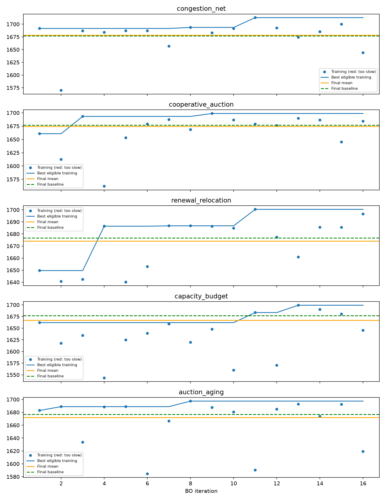

# Late activation: 16 BO trials ×100 full maps, then2000 fresh maps

Base is expanded local food. Runtime includes initialization and result processing. Intervals are pointwise paired bootstrap intervals (10,000 resamples), not adjusted for multiple comparisons. No final-map tuning.

| Strategy | Training best | Final mean | Score95% CI | Paired gain95% CI | Mean seconds/game | Under20s | CPU µs/population tick |
|---|---:|---:|---|---|---:|---|---:|
| congestion_net | 1712.8880875832892 | 1678.6 | 1661.8–1695.1 | +1.8 [-8.1, +12.0] | 13.88 | yes | 811.7 |
| expanded_food_baseline | — | 1676.8 | 1660.1–1693.7 | +0.0 [+0.0, +0.0] | 13.68 | yes | 799.9 |
| cooperative_auction | 1698.727308217925 | 1674.6 | 1658.2–1691.3 | -2.2 [-4.4, +0.1] | 13.66 | yes | 801.4 |
| renewal_relocation | 1700.4034524549343 | 1674.2 | 1657.8–1690.7 | -2.6 [-5.3, -0.0] | 13.66 | yes | 801.7 |
| auction_aging | 1697.391923371368 | 1672.0 | 1655.5–1688.7 | -4.8 [-11.9, +2.4] | 13.72 | yes | 805.7 |
| capacity_budget | 1699.2497265700565 | 1666.9 | 1650.6–1683.1 | -9.9 [-21.3, +1.6] | 14.05 | yes | 828.1 |

## Selected activation rules

| Strategy | Time threshold (ticks / seconds) | Population below | Logic | Persistence |
|---|---|---:|---|---|
| congestion_net | 23008 / 2300.8 | 3 | population | latched |
| cooperative_auction | 20925 / 2092.5 | 11 | AND | reversible |
| renewal_relocation | 20523 / 2052.3 | 6 | time | latched |
| capacity_budget | 12906 / 1290.6 | 9 | AND | latched |
| auction_aging | 16548 / 1654.8 | 6 | AND | latched |

Strategies failing the final runtime limit are not recommended. A reversible switch restores settings but retains learned map information. Training/test gaps include selection optimism and map differences.

