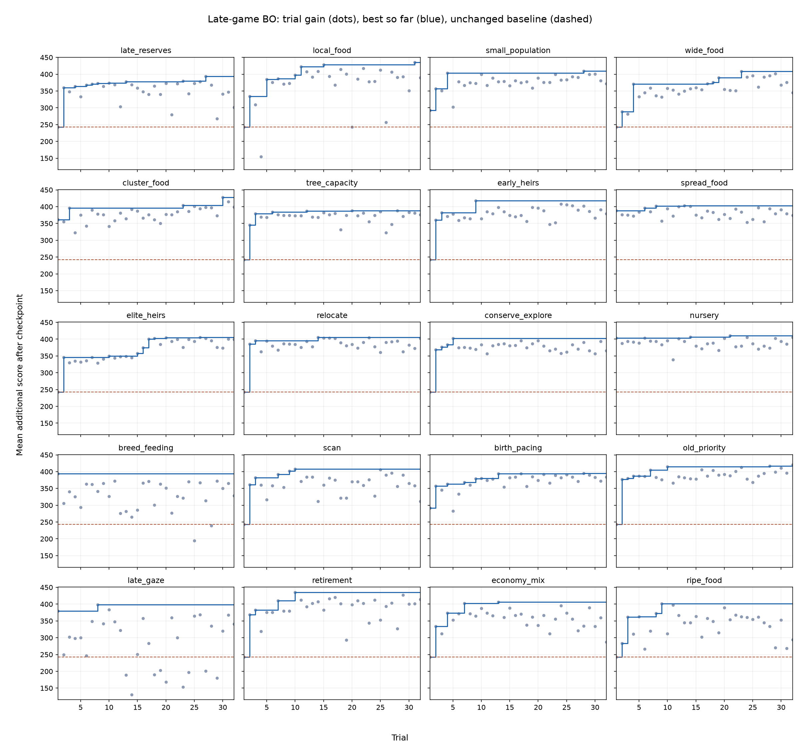

# Late-game tuning evolution

32 trials per family on the same 200 checkpoints. Unchanged scheduled breeding gains 242.8 score after the checkpoint on average. Scores below are additional score, not full-game scores. Trial 1 is a family-specific seeded configuration, which can differ from the baseline.

| Family | Trial 1 gain | Best gain | Best trial | Full-game mean (1000 maps) |
|---|---:|---:|---:|---:|
| late_reserves | 242.8 | 393.8 | 27 | 1548.8 |
| local_food | 242.8 | 435.4 | 31 | 1598.2 |
| small_population | 292.2 | 409.0 | 28 | 1405.5 |
| wide_food | 242.8 | 408.3 | 23 | 1548.7 |
| cluster_food | 361.4 | 427.8 | 30 | 1562.5 |
| tree_capacity | 242.8 | 388.4 | 28 | 1450.9 |
| early_heirs | 242.8 | 417.8 | 9 | 1529.3 |
| spread_food | 388.6 | 402.9 | 13 | 1549.1 |
| elite_heirs | 242.8 | 405.5 | 26 | 1555.6 |
| relocate | 242.8 | 405.1 | 14 | 1558.7 |
| conserve_explore | 242.8 | 402.3 | 5 | 1531.4 |
| nursery | 403.7 | 410.7 | 21 | 1547.0 |
| breed_feeding | 394.2 | 394.2 | 1 | 1515.0 |
| scan | 242.8 | 407.7 | 10 | 1548.4 |
| birth_pacing | 292.2 | 394.5 | 28 | 1543.5 |
| old_priority | 243.5 | 420.3 | 32 | 1528.6 |
| late_gaze | 379.5 | 398.7 | 8 | 1537.9 |
| retirement | 242.8 | 435.1 | 10 | 1521.7 |
| economy_mix | 242.8 | 406.0 | 13 | 1559.8 |
| ripe_food | 242.8 | 401.8 | 9 | 1494.2 |

The tail-state objective does not guarantee full-game improvement. Retirement nearly matches local_food on training gain (435.1 versus 435.4), but its full-game mean is much lower (1521.7 versus 1598.2). All candidates were frozen before the fresh evaluation. Selecting a winner from these test results introduces selection uncertainty; the reported 95% intervals are pointwise.

[Full-game scores, confidence intervals, paired gains and timings](final/RESULTS.md)

Training active pod time: 4.16 pod-hours, approximately $3.99 at $0.96/pod-hour. Includes checkpoint construction and verification; excludes setup, storage and idle time.
