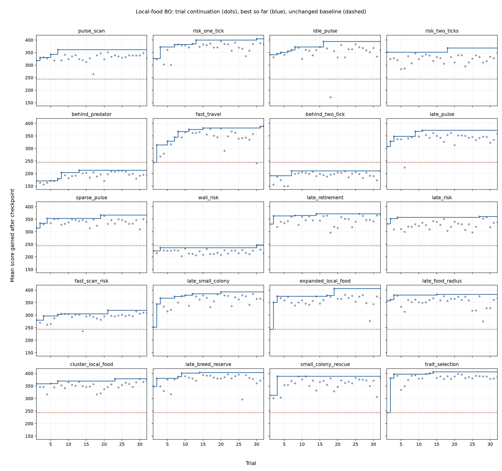

# Local-food successor research

20 families, 32 Bayesian-optimization trials each, 200 shared local_food checkpoints 250 seconds before extinction. Winners were frozen before 1000 fresh full games per model (seeds 15001–16000).

Unchanged local_food gains 243.98 points after these checkpoints. Training gain below is relative to that continuation, not a full-game score.

| Family | First trial continuation | Best continuation | Best trial | Training gain vs local_food | Full-game mean | Paired gain vs local_food (95% CI) | Paired gain vs scheduled breeding (95% CI) |
|---|---:|---:|---:|---:|---:|---|---|
| pulse_scan | 317.9 | 361.9 | 7 | +117.9 | 1487.8 | -157.1 [-186.0, -128.3] | -63.0 [-92.9, -32.5] |
| risk_one_tick | 327.0 | 404.9 | 30 | +161.0 | 1673.5 | +28.6 [+2.5, +54.2] | +122.7 [+96.2, +149.6] |
| idle_pulse | 341.6 | 394.0 | 16 | +150.0 | 1636.5 | -8.4 [-34.2, +17.5] | +85.7 [+59.5, +112.1] |
| risk_two_ticks | 351.7 | 368.1 | 18 | +124.2 | 1543.8 | -101.1 [-129.7, -73.7] | -7.0 [-36.1, +23.0] |
| behind_predator | 170.6 | 212.9 | 13 | -31.0 | 1337.7 | -307.2 [-333.0, -281.0] | -213.0 [-239.7, -186.0] |
| fast_travel | 244.0 | 391.5 | 32 | +147.5 | 1659.2 | +14.3 [-11.0, +39.7] | +108.5 [+83.7, +133.7] |
| behind_two_tick | 191.3 | 211.0 | 7 | -32.9 | 1359.0 | -285.9 [-311.6, -260.0] | -191.8 [-217.2, -166.8] |
| late_pulse | 307.5 | 372.7 | 11 | +128.8 | 1550.4 | -94.5 [-119.6, -70.0] | -0.4 [-25.1, +25.6] |
| sparse_pulse | 315.5 | 366.9 | 19 | +122.9 | 1576.2 | -68.7 [-94.9, -42.8] | +25.4 [-1.4, +53.3] |
| wall_risk | 223.9 | 247.9 | 30 | +4.0 | 1447.5 | -197.4 [-223.2, -171.9] | -103.2 [-130.2, -76.1] |
| late_retirement | 330.8 | 372.3 | 14 | +128.4 | 1573.7 | -71.2 [-98.5, -44.0] | +23.0 [-4.2, +50.5] |
| late_risk | 332.0 | 361.4 | 27 | +117.5 | 1644.5 | -0.4 [-27.6, +26.0] | +93.8 [+65.8, +122.2] |
| fast_scan_risk | 279.9 | 319.2 | 21 | +75.2 | 1483.6 | -161.3 [-191.6, -131.6] | -67.2 [-97.0, -37.5] |
| late_small_colony | 252.4 | 392.7 | 20 | +148.7 | 1639.6 | -5.3 [-31.5, +21.3] | +88.9 [+62.1, +116.5] |
| expanded_local_food | 244.0 | 406.1 | 19 | +162.1 | 1706.0 | +61.1 [+34.7, +86.8] | +155.3 [+129.0, +182.2] |
| late_food_radius | 356.7 | 382.9 | 15 | +138.9 | 1662.5 | +17.6 [-7.9, +43.0] | +111.8 [+85.7, +138.9] |
| cluster_local_food | 359.2 | 379.0 | 23 | +135.0 | 1641.9 | -3.0 [-28.4, +22.9] | +91.2 [+64.9, +118.5] |
| late_breed_reserve | 348.0 | 404.2 | 14 | +160.3 | 1656.1 | +11.2 [-13.6, +37.2] | +105.3 [+79.1, +132.3] |
| small_colony_rescue | 313.1 | 388.6 | 3 | +144.7 | 1601.6 | -43.3 [-69.3, -16.3] | +50.9 [+24.0, +78.9] |
| trait_selection | 244.0 | 406.5 | 14 | +162.5 | 1650.8 | +5.9 [-20.9, +32.6] | +100.0 [+73.5, +127.3] |

Every family retunes four breeding trait weights, so differences are effects of the complete tuned configurations, not isolated causal effects of the named feature. Each first trial is family-specific. Tail checkpoints cannot reliably distinguish activation thresholds that precede the checkpoint; fresh full games test the resulting early-game consequences.

Confidence intervals are pointwise paired bootstrap intervals, not adjusted for searching across 20 families. Selecting the highest test score introduces selection uncertainty.

## Recorded deaths

Mean counts per full game. Energy deaths include aging/starvation. Counts depend on population and game duration; they are not exposure-adjusted death rates.

| Model | Predator deaths | Energy deaths |
|---|---:|---:|
| expanded_local_food | 198.31 | 345.50 |
| risk_one_tick | 139.20 | 372.85 |
| late_food_radius | 210.88 | 331.65 |
| fast_travel | 207.46 | 334.33 |
| late_breed_reserve | 198.51 | 332.14 |
| trait_selection | 212.88 | 338.38 |
| local_food_baseline | 218.99 | 326.06 |
| late_risk | 178.97 | 354.79 |
| cluster_local_food | 204.13 | 334.22 |
| late_small_colony | 198.53 | 314.93 |
| idle_pulse | 219.98 | 324.48 |
| small_colony_rescue | 227.65 | 317.14 |
| sparse_pulse | 206.19 | 322.45 |
| late_retirement | 193.33 | 328.14 |
| scheduled_breeding_baseline | 207.53 | 310.83 |
| late_pulse | 211.89 | 314.55 |
| risk_two_ticks | 205.60 | 332.62 |
| pulse_scan | 198.08 | 322.54 |
| fast_scan_risk | 183.52 | 335.42 |
| original_baseline | 113.19 | 146.11 |
| wall_risk | 159.69 | 357.88 |
| behind_two_tick | 153.34 | 337.92 |
| behind_predator | 203.75 | 306.44 |

[All means, confidence intervals and compute times](final/RESULTS.md)

Training active compute: 3.89 pod-hours, approximately $3.73. Excludes setup, storage and idle time. Evaluation cost is reported separately in the full results.
