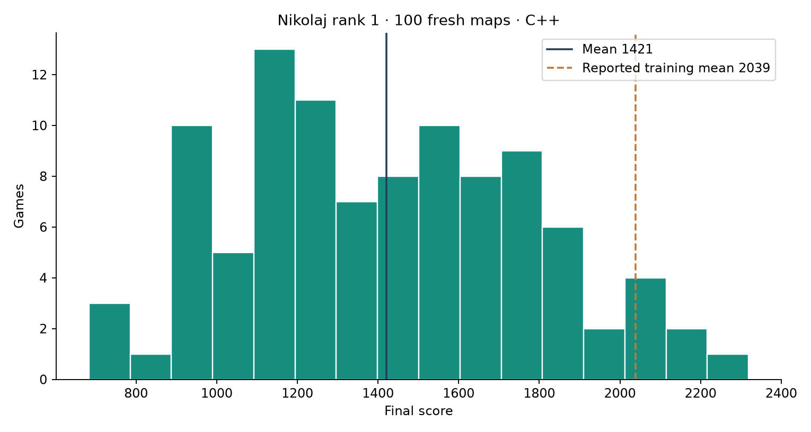

# Nikolaj rank-1 policy: 100 fresh maps

**Mean score: 1421.4**, with a bootstrap 95% interval of **1349.9–1492.2**.

| Measure | Result |
|---|---:|
| Games completed | 100 / 100 |
| Median score | 1402.1 |
| Score standard deviation | 363.2 |
| Minimum / maximum score | 683.3 / 2319.0 |
| Games scoring above 2000 | 7 / 100 |
| Mean survival | 1440.6 simulated seconds |
| Reached 3000 seconds | 0 / 100 |
| Parallel batch runtime | 45.9 seconds |
| Mean runtime per game | 6.74 seconds |

All 100 seeds (5001–5100) were selected before the run and were outside the
published four training maps (0–3). The policy configuration was frozen and no
tuning used these results. Policy randomness used independent seed 0. Both
simulator and policy ran in C++, with natural predator spawning and ordinary
energy/food/aging. Every game ended with predators present. No competition
validation endpoint was contacted.

The reported 2038.7 average therefore did not reproduce in this fresh-map C++
benchmark. Differences include the maps, current implementation versus older
Python training code, platform and potentially floating-point trajectories.
This experiment does not isolate the causes of that gap, nor compare the policy
against a baseline on these same maps.

The dedicated Runpod machine had 16 CPUs attached to an L40S; the GPU was unused.
Runtime above excludes startup, build and transfer. **The pod is deliberately
left running at the user's request, at $1.09/hour.** Current cost estimate and
connection details are in [compute.json](compute.json).

- [Every game's score and metrics](games.jsonl)
- [Exact configuration, seeds, software and source hashes](manifest.json)
- [Aggregate statistics](summary.json)
- [Frozen protocol](PROTOCOL.md)
- [Earlier privileged-input audit](../nikolaj_validation/PRIVILEGE_AUDIT.md)

Reproduce inside the source checkout:

    python fastsim/build.py
    python fastsim/build_policy.py
    python scripts/benchmark_winner100.py --workers 16 --out fresh-output
