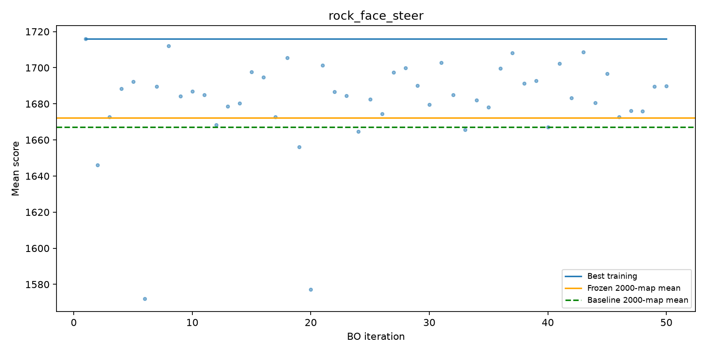

# Self-stuck: 50 BO iterations × 320 full maps, then the same 2,000 maps

New rock-face winner, previous rock-face winner and unchanged expanded-local-food baseline. All three policies for each final seed ran on the same worker. The final seeds were reused from the prior campaign: this is a repeat benchmark, not a fresh holdout. Intervals are pointwise paired percentile bootstrap intervals (10,000 resamples), not multiplicity-adjusted. No tuning on final maps.

| Model | Training best | Test mean | 95% CI | Paired gain | Paired 95% CI | Policy µs/tick | Loop CPU µs/tick | Seconds/game |
|---|---:|---:|---|---:|---|---:|---:|---:|
| rock_face_steer | 1716.091970981225 | 1672.4 | 1655.1–1689.7 | +5.3 | -9.6–+20.5 | 414.9 | 819.4 | 14.0 |
| previous_rock_face | — | 1672.4 | 1655.1–1689.7 | +5.3 | -9.6–+20.5 | 416.8 | 820.9 | 14.1 |
| expanded_food_baseline | — | 1667.1 | 1650.3–1684.3 | +0.0 | +0.0–+0.0 | 411.6 | 814.3 | 13.9 |

Training/test differences include selection optimism and map sampling. They use the same full-game initialization, unlike the earlier late-game checkpoint campaign. Policy timing includes scheduling delays; loop CPU time is per-process CPU. A tick covers the whole population.

New versus previous rock-face winner: +0.0 points, paired 95% CI [+0.0, +0.0].
