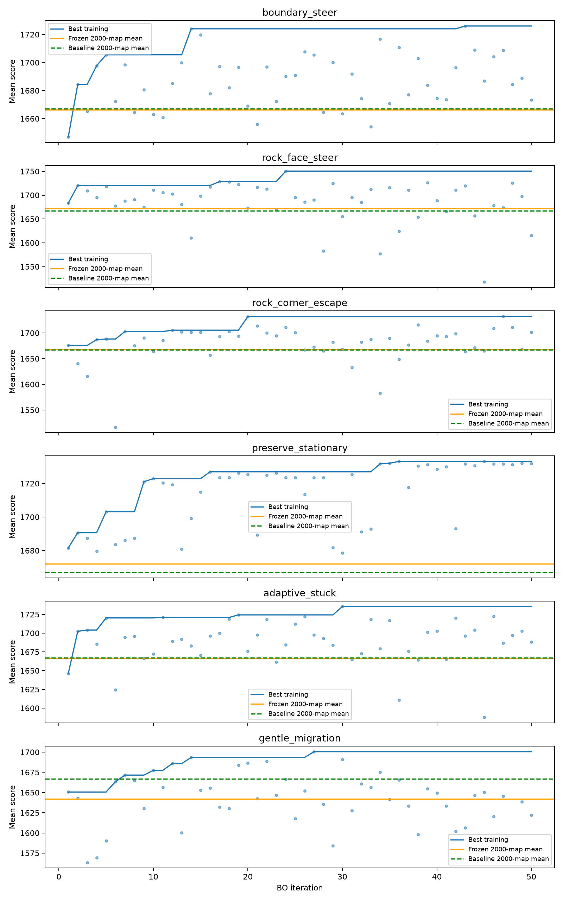

# Self-stuck: 50 BO iterations × 150 full maps, then 2,000 fresh maps

Six independently frozen family winners and the unchanged expanded-local-food baseline. All seven policies for each final seed ran on the same worker. Intervals are pointwise paired percentile bootstrap intervals (10,000 resamples), not multiplicity-adjusted. No tuning on final maps.

| Model | Training best | Test mean | 95% CI | Paired gain | Paired 95% CI | Policy µs/tick | Loop CPU µs/tick | Seconds/game |
|---|---:|---:|---|---:|---|---:|---:|---:|
| rock_face_steer | 1750.5133454994912 | 1672.4 | 1655.1–1689.7 | +5.3 | -9.6–+20.5 | 514.7 | 956.6 | 16.3 |
| preserve_stationary | 1733.1552444111023 | 1672.1 | 1655.1–1689.1 | +5.1 | -5.4–+15.5 | 512.7 | 952.5 | 16.2 |
| rock_corner_escape | 1732.5253976008635 | 1667.7 | 1651.2–1684.5 | +0.6 | -14.6–+15.7 | 518.8 | 963.7 | 16.4 |
| expanded_food_baseline | — | 1667.1 | 1650.3–1684.3 | +0.0 | +0.0–+0.0 | 511.7 | 950.1 | 16.1 |
| boundary_steer | 1726.042323316444 | 1666.2 | 1649.3–1683.1 | -0.9 | -15.1–+13.7 | 515.2 | 956.7 | 16.2 |
| adaptive_stuck | 1735.5320813869278 | 1666.1 | 1649.3–1683.2 | -0.9 | -17.4–+15.2 | 518.0 | 962.8 | 16.3 |
| gentle_migration | 1700.5926555053754 | 1642.2 | 1624.9–1660.0 | -24.8 | -42.9–-7.0 | 555.5 | 991.2 | 16.2 |

Training/test differences include selection optimism and map sampling. They use the same full-game initialization, unlike the earlier late-game checkpoint campaign. Policy timing includes scheduling delays; loop CPU time is per-process CPU. A tick covers the whole population.

