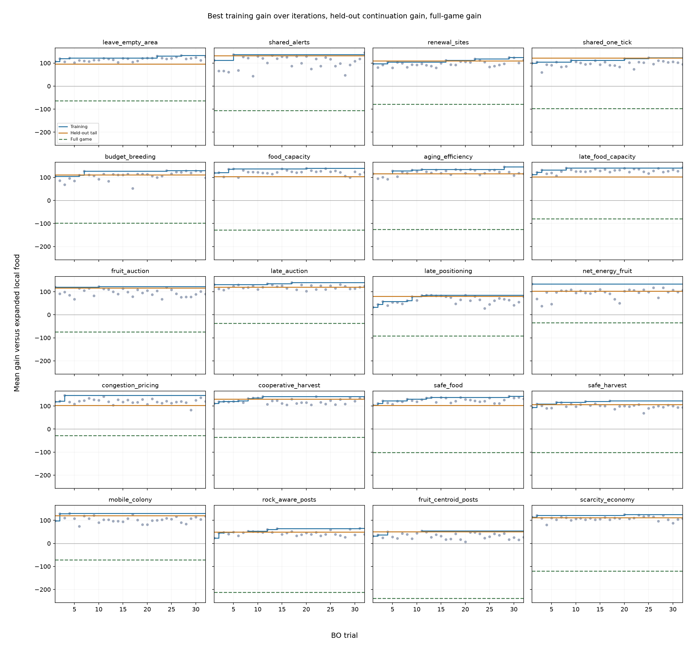

# Shared-food: training versus independent validation versus full games

200 training checkpoints, 200 fresh validation checkpoints, 1000 fresh full games per model. Training baseline continuation 243.68; held-out baseline continuation 245.23. All gains compare with expanded local food within their own panel.

| Family | Best trial | Train gain | Held-out checkpoint gain (95% CI) | Train − validation | Full-game gain (95% CI) | Full-game mean |
|---|---:|---:|---|---:|---|---:|
| leave_empty_area | 27 | +132.6 | +96.3 [+63.5, +130.7] | +36.3 | -64.0 [-92.7, -35.7] | 1612.4 |
| shared_alerts | 32 | +145.8 | +131.9 [+97.3, +167.7] | +14.0 | -106.3 [-134.5, -77.8] | 1570.0 |
| renewal_sites | 29 | +124.8 | +109.7 [+78.5, +141.9] | +15.1 | -78.9 [-107.7, -50.5] | 1597.5 |
| shared_one_tick | 25 | +122.9 | +122.1 [+88.9, +157.6] | +0.9 | -96.7 [-126.9, -67.8] | 1579.7 |
| budget_breeding | 24 | +129.5 | +110.6 [+79.2, +143.6] | +18.8 | -97.9 [-126.5, -70.4] | 1578.4 |
| food_capacity | 20 | +139.6 | +103.9 [+72.5, +136.2] | +35.7 | -128.3 [-157.2, -99.9] | 1548.0 |
| aging_efficiency | 28 | +145.4 | +116.1 [+85.5, +148.5] | +29.3 | -126.2 [-155.7, -97.5] | 1550.1 |
| late_food_capacity | 32 | +143.2 | +102.8 [+71.1, +136.4] | +40.4 | -79.4 [-107.3, -51.1] | 1596.9 |
| fruit_auction | 10 | +122.3 | +116.7 [+82.3, +153.8] | +5.6 | -74.2 [-104.7, -44.4] | 1602.2 |
| late_auction | 17 | +139.5 | +119.7 [+87.2, +154.0] | +19.8 | -37.0 [-64.1, -9.8] | 1639.4 |
| late_positioning | 13 | +85.4 | +79.9 [+47.2, +114.4] | +5.5 | -92.4 [-118.8, -66.1] | 1584.0 |
| net_energy_fruit | 1 | +133.6 | +102.1 [+69.7, +135.1] | +31.4 | -34.6 [-63.4, -6.5] | 1641.7 |
| congestion_pricing | 3 | +146.4 | +102.6 [+73.0, +134.8] | +43.8 | -27.8 [-54.2, -0.7] | 1648.6 |
| cooperative_harvest | 11 | +141.1 | +130.0 [+95.4, +166.9] | +11.1 | -35.5 [-63.2, -8.1] | 1640.9 |
| safe_food | 29 | +142.1 | +102.1 [+71.9, +134.1] | +40.0 | -101.5 [-129.8, -73.5] | 1574.9 |
| safe_harvest | 17 | +123.1 | +106.7 [+74.0, +141.4] | +16.4 | -102.1 [-131.4, -73.1] | 1574.3 |
| mobile_colony | 4 | +130.6 | +120.4 [+87.1, +155.0] | +10.2 | -71.0 [-99.7, -42.5] | 1605.4 |
| rock_aware_posts | 31 | +65.0 | +49.9 [+23.4, +77.7] | +15.2 | -212.2 [-237.6, -186.1] | 1464.2 |
| fruit_centroid_posts | 11 | +54.6 | +50.6 [+20.0, +82.8] | +4.0 | -238.1 [-265.9, -210.7] | 1438.3 |
| scarcity_economy | 20 | +124.9 | +111.2 [+77.8, +146.2] | +13.8 | -119.5 [-149.3, -89.9] | 1556.8 |

The train−validation gap measures optimism on the same continuation task (plus sampling uncertainty). The validation/full-game difference includes a change in initialization and policy-induced early-game states. The latter is not an overfitting estimate. All intervals are pointwise paired percentile bootstrap intervals, not corrected for comparing 20 candidates. All families retune breeding weights, so this is not a single-feature ablation.

Short baseline games with checkpoints at time zero: training 1/200, validation 0/200.

[Full-game means, CIs and compute times](final/RESULTS.md)

## Untuned sharing control

Sharing only: held-out continuation +96.0 [+64.1, +128.0], full game -38.9 [-67.1, -11.0].

## Full-game death counts

Counts per game, not exposure-adjusted rates. Energy includes aging/starvation.

| Model | Predator deaths | Energy deaths |
|---|---:|---:|
| expanded_food_baseline | 197.74 | 339.40 |
| congestion_pricing | 179.69 | 349.88 |
| net_energy_fruit | 175.82 | 347.36 |
| cooperative_harvest | 184.31 | 354.21 |
| late_auction | 175.29 | 351.86 |
| shared_food_control | 175.18 | 348.79 |
| leave_empty_area | 167.59 | 341.15 |
| local_food_baseline | 220.10 | 316.57 |
| mobile_colony | 158.68 | 345.31 |
| fruit_auction | 158.62 | 372.70 |
| renewal_sites | 152.41 | 342.72 |
| late_food_capacity | 199.17 | 334.38 |
| late_positioning | 172.19 | 345.75 |
| shared_one_tick | 173.06 | 347.34 |
| budget_breeding | 198.89 | 330.47 |
| safe_food | 168.20 | 342.37 |
| safe_harvest | 164.60 | 356.64 |
| shared_alerts | 170.06 | 339.99 |
| scarcity_economy | 167.33 | 392.93 |
| scheduled_breeding_baseline | 204.47 | 309.67 |
| aging_efficiency | 182.27 | 340.27 |
| food_capacity | 148.80 | 202.89 |
| rock_aware_posts | 161.43 | 314.92 |
| fruit_centroid_posts | 141.34 | 326.97 |

training active compute attribution: $14.57, excludes idle/storage/setup.

validation active compute attribution: $1.58, excludes idle/storage/setup.

full-game active compute attribution: $21.73, excludes idle/storage/setup.
