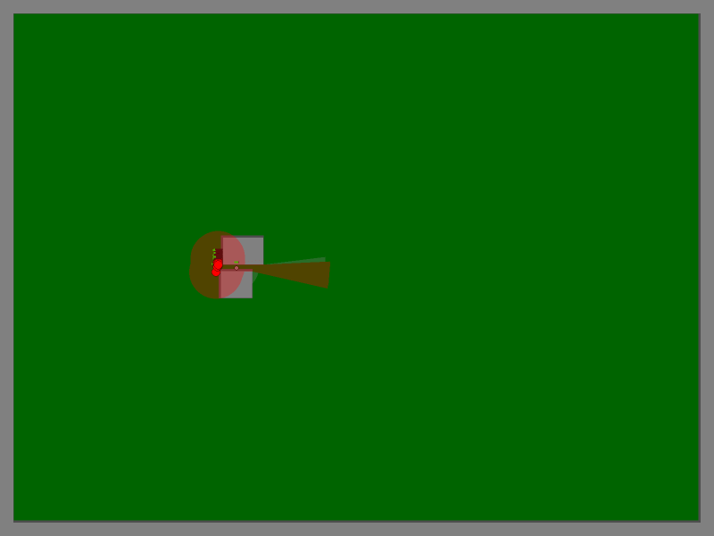

# Sequential predator intake: ongoing validation

The strongest guided result so far is **v4: a long straight approach followed by
an outside sacrifice**. Three full 3,000-second games (seeds 4331, 483, 484) acquired all 33 sequential
predators, with zero physical losses and zero attention losses in the same
15-wide, 90/70-face, offset−5 setup. Two different geometries failed full33
retention: seed481 finished31 and seed482 finished21 in the scored front region
(with five additional predators at the rear mouth). The bait survived; all 33 guides
were sacrificed.

The trap is an observed size-selective passage between two obstacles. An agent
fits through an 11–19 unit gap; a predator does not. The bait stays 30 units
inside. Each supplied guide centers 125 units outside the observed mouth,
waits until it observes a predator behind within 50 units, then leads straight
toward the mouth for 50 units and holds at 75 units outside until sacrificed.
This gives the follower time to align while keeping the guide away from the
old trapped mass. Earlier routes that brought guides closer failed at scale.

This is not yet a complete scattered-predator collection policy. Fixtures
supply the bait near the entrance and fresh guides already followed by incoming
predators. Autonomous site discovery, recruitment and collection throughout a
random map are not demonstrated. Food is supplied by restoring agent energy
each tick. Predator movement, sensing, rest, target selection and collision are
unmodified simulator behavior.

The [browser visualizer](http://127.0.0.1:9055/research/strategy_visualization/index.html)
compares these strategies using native rendering and offers a separate read-only
Sol question session. The [full replay library](http://127.0.0.1:9053/) is also live.

## Completed evidence

| Candidate / fixture | Arrivals | Horizon | Result |
|---|---:|---:|---|
| Existing single-wall staged guides, 90-second spacing, seeds 201–203 | Intended 33 | Intended 3,000 s | All lost bait after only 8–14 arrivals |
| Gap 15 × 90, aligned approach, seed 302 | 33 at 12-second spacing | 900 s | All acquired; no physical or target losses |
| Gap 15 × 90, aligned approach, seed 303 | 33 at 90-second spacing | 3,000 s | All acquired; no physical or target losses; bait alive |
| Gap 15 × 90, aligned approach, native-rendered seed 413 | 33 at 90-second spacing | 3,000 s | All acquired; no physical or target losses; bait alive |
| Gap 11 × 55, aligned approach, seed 411 | 33 at 90-second spacing | 3,000 s | All acquired; no physical or target losses; bait alive |
| Gap 19 × 100, aligned approach, seed 412 | 33 at 90-second spacing | 3,000 s | All acquired; no physical or target losses; bait alive |
| Generalized gap, native-example unequal vertical dimensions, seed 501 | 33 at 90-second spacing | 3,000 s | All acquired; no physical or target losses |
| Generalized gap, native-example unequal horizontal dimensions, seed 502 | 33 at 90-second spacing | 3,000 s | All acquired; no physical or target losses |
| Frozen gap v1, lateral ±25, heading jitter ±0.5, awake seed 401 | 33 | 900 s | 32 acquired; none lost afterward |
| Frozen gap v1, lateral ±60, heading jitter ±0.8, awake seed 402 | 33 | 900 s | 26 acquired; none lost afterward |
| Frozen gap v1, lateral ±25, heading jitter ±0.5, resting seed 403 | 33 | 900 s | All acquired; none lost afterward |
| Frozen gap v1, lateral ±60, heading jitter ±0.8, resting seed 404 | 33 | 900 s | 22 acquired; none lost afterward |

The wide-approach failures distinguish retention from collection: the trap kept
every predator it acquired, but some approaching predators never reached it.
The completed full games establish the tested configurations, not universal reliability across maps or incoming routes.

## Guided-delivery v1: insufficiently reliable

The first centered-guide route used a waypoint 18 units outside the mouth.
Guides were supplied at off-axis approach points, and first moved to that
waypoint before entering the gap. It passed small 4- and 8-arrival pilots but
failed the main 33-arrival full game: all 33 were acquired, then one followed a
later guide sideways and escaped. The bait and other 32 survived.

Independent full-game tests of the frozen route confirmed this sensitivity:

| Seed | Lateral offset | Approach distance | Follower gap | Acquired | Final held | Escapes | Guides lost |
|---|---:|---:|---:|---:|---:|---:|---:|
| 441 | ±90 | 180 | 50 | 32/33 | 31 | 1 | 33 |
| 442 | ±30 | 150 | 80 | 33/33 | 33 | 0 | 33 |

The successful seed's replay-sampled maximum mouth distance after confirmed
acquisition was 28.72 units, while the failed seed's escaped predator traveled
985 units away. Exact every-tick retention metrics determine pass/fail; sampled
replay extrema are only lower bounds on the true maximum excursion.

The axial v2 revision first centers guides 75 units outside the mouth, then
charges into the gap. It also failed at scale: seed 4311 acquired all 33 but
recorded 13 predators leaving containment and finished with 22; independent
seed 462 acquired all 33 but recorded 20 leaving containment and finished with
14. Some losses were followed by recapture, so final count alone understates
the failure. Small four-predator pilots had passed.

A HOLD-at-75 variant kept the old mass but captured only two of four newcomers.
V4 adds the longer straight lead-in described above. Seed4331 then passed all33
through3,000 seconds, with maximum mouth distance33.281 and no active target
switches. Fresh seeds483 and484 also passed the same setup; other geometries failed. A separate shallow-bait/nearer-HOLD candidate
failed at33: seed4702 acquired33 but recorded26 physical losses and finished11.

## Availability and fallback limits

The existing native-map geometry census found eligible narrow-passage entrances
in 19 of 40 maps, comprising 23 distinct obstacle pairs. This is a read-only,
privileged census for feasibility; it does not supply sites to the controller
and does not demonstrate an agent discovering them. Equal aligned faces are
not a realistic detection requirement, so the generalized mapper also accepts
overlapping unequal and offset faces.

The single-wall alternative is a three-predator candidate at a 30 × 100 wall,
with two protected baits and supplied delivery guides. The frozen final policy
passed 10/10 recorded cases, including four full 3,000-second games (seeds 225,
451, 452, 453); all had zero physical escapes. Eleven such traps would
have arithmetic capacity for 33. Their availability, assignment, travel routes,
and simultaneous operation have not been established.

## Observation boundary and scoring

The policy receives JSON-compatible native observation DTOs and public simulated
time. It constructs its own local map from Edge observations and agent-relative
observations. Hidden world coordinates, predator identity, energy, resting state,
and evaluator target choices are not passed to the policy. Fixture arrangement
and evaluation use hidden state, separately from the action decision.

Acquisition requires two seconds of consecutive qualifying containment. Physical
retention and active attention are scored separately; a sleeping predator must
still be geometrically contained. A full success requires all requested arrivals,
all acquisitions, no subsequent losses, the requested horizon, and every predator
held over the final 30 seconds. No arrivals after a premature bait death are
counted as successes.

## Native visual check

This is the final frame of the generalized-mapper 180-second demonstration,
not a full-game guided-delivery replay. Overlapping predator bodies cannot be
counted individually in this image; the recorded state contains all 33.

## Files

- [Independent validation contract](../survival/research/intake_validation/CONTRACT.md)
- [Frozen gap v1 policy](../survival/research/intake_validation/gap_v1/observed_gap_policy.py)
- [Full-game native replay](../survival/results/intake_validation/gap_v1/replays/observed-gap-g15-l90-n33-i90-s413-747ab40d.json.gz)
- [Independent guided v1 full games](../survival/results/intake_validation/guided_gap_v1/stress-summary.json)
- [Independent approach stress receipts](../survival/results/intake_validation/gap_v1/stress-summary.json)
- [Sparse single-wall baseline](../survival/results/intake_validation/baseline-sparse.json)
- [Gap geometry research](../survival/research/intake_geometry_sol/)
- [Guide delivery research](../survival/research/intake_guides_sol/)
- [Single-wall gate research](../survival/research/intake_gate_sol/)

Every completed simulation is recorded with ReplayRecorder. Results and source
provenance are being audited before final delivery. Replays remain local under
the existing repository ignore rules. Research will stop when account telemetry
reports 60% usage remaining, under the user's later authorization.

## Stopped at user request

Research and new model calls were paused on the user's explicit stop request,
with82% account usage remaining. Rotation controls485 and495 were interrupted
and saved as partial runs (about1,700 seconds,19 arrivals each, no losses so
far); they are not full-game successes or completed failures. The browser
viewer remains available. Three full v4 successes establish the tested setup,
but autonomous deployment and general reliability across native maps remain
unproved. The latest completed audit checked70 replays with no unexplained
errors; one failed run has a documented missing instantaneous staged-guide
birth/death event, with its death retained in the experiment receipt.

## Resumed: shallow bait and random-start native maps

The user subsequently authorized work until 60% usage remains, permitted
perfect static map information, and required independent random map-wide
starts for every new bait, guide, and predator. The runtime predator inputs
remain native observations; evaluator coordinates and target choices are
not controller inputs. Agent energy is refilled; predators remain native.

The completed shallow-depth sweep currently supports 5 units inside the
mouth as the smallest tested position that survived all crowd fixtures.
Depths -5, 0, 2.5, and 4 failed at all three gap widths (11, 15, 19).
Depth 4.5 survived only gap 11. Depth 4.9 survived single-predator tests
but failed both 33-predator crowd seeds at gap 19. Depth 5 retained all
33 in six 120-second crowd tests, two seeds per gap width. The closest
recorded center distance was 15.016738; native contact kills below 15.
This establishes a tested boundary, not universal deployment reliability.

The depth-5 guided rerun subsequently completed all 3,000 seconds:
33/33 acquired and retained, zero physical or joint losses, bait alive,
33 guides sacrificed (seed 483, gap 15). All 30,001 native frames are
available, replay suffix `77cfe59d`. This remains an arranged delivery
fixture, not a random-start native-map success.

Every frame is retained with native rendering in the
[depth viewer](http://127.0.0.1:9055/research/depth5_test/viz.html).
See [depth research notes](../survival/research/depth5_test/README.md)
for receipts and current long-test status.

The first substantive random-start native-map pilot (map 5101, fixture
9101, 120 seconds) deployed its bait at 5.9 seconds and found a predator
around 41 seconds, but failed delivery due to route-state handling. It
is recorded as a failure. Real-map generalization is not yet established.

The user then narrowed the deployment scenario: ordinary fruit gatherers
spawn a child when they observe a predator, and guide that predator to
the bait. Predator search is therefore outside the current objective.
The chosen implementation keeps the parent as guide and lets the child
continue gathering/evading. Initial actors remain independently random;
the child's birth uses the native nearby spawn behavior. Delivery metrics
are conditional on an ordinary observed encounter, with encounter time
reported separately. The child remains present and can affect targeting.
